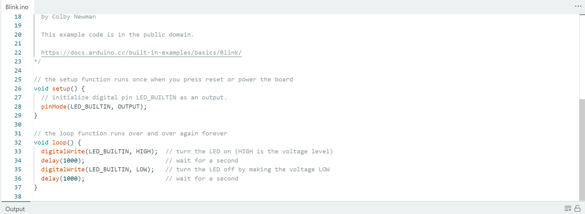
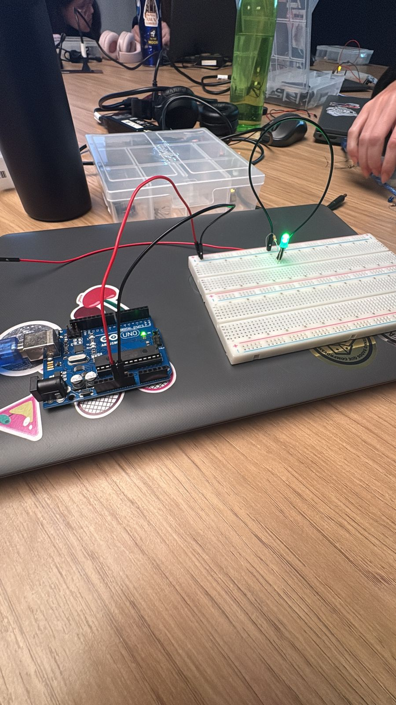
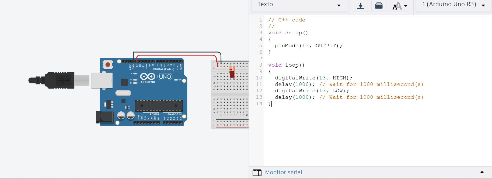

# Atividade Arduino — Blink LED

Repositório criado para as atividades práticas de **pisca-pisca (Blink)** com Arduino, realizadas durante o módulo de eletrônica e programação embarcada.


## Parte 1: Blink LED Interno

Nesta parte, foi realizado o clássico **Blink** utilizando o **LED interno do Arduino**.  
O programa faz LEDs acenderem por um tempo, apagar e aguardar alguns segundos, repetindo esse ciclo continuamente.

### Objetivo
- Configurar o ambiente de desenvolvimento (Arduino IDE);
- Compreender o funcionamento básico de um loop no Arduino;
- Fazer o LED interno piscar com um intervalo personalizado.

### Código Utilizado
```/*
  Blink

  Turns an LED on for one second, then off for one second, repeatedly.

  Most Arduinos have an on-board LED you can control. On the UNO, MEGA and ZERO
  it is attached to digital pin 13, on MKR1000 on pin 6. LED_BUILTIN is set to
  the correct LED pin independent of which board is used.
  If you want to know what pin the on-board LED is connected to on your Arduino
  model, check the Technical Specs of your board at:
  https://docs.arduino.cc/hardware/

  modified 8 May 2014
  by Scott Fitzgerald
  modified 2 Sep 2016
  by Arturo Guadalupi
  modified 8 Sep 2016
  by Colby Newman

  This example code is in the public domain.

  https://docs.arduino.cc/built-in-examples/basics/Blink/
*/

// the setup function runs once when you press reset or power the board
void setup() {
  // initialize digital pin LED_BUILTIN as an output.
  pinMode(LED_BUILTIN, OUTPUT);
}

// the loop function runs over and over again forever
void loop() {
  digitalWrite(LED_BUILTIN, HIGH);  // turn the LED on (HIGH is the voltage level)
  delay(1000);                      // wait for a second
  digitalWrite(LED_BUILTIN, LOW);   // turn the LED off by making the voltage LOW
  delay(1000);                      // wait for a second
}

```

O arquivo com o código também pode ser encontrado em: [código](led_blink.ino).

##### Screenshot do código na Arduino IDE


##### Foto do Arduino conectado e LED aceso


##### Vídeo demonstrando o funcionamento
https://drive.google.com/drive/folders/18vwX78nwUYtFjIMXMa92UOnBc5WWcgON?usp=drive_link


## Parte 2: Simulando Blink Externo (TinkerCad)

Simulação de um LED externo piscando utilizando o TinkerCad Circuits, com Arduino Uno, protoboard, LED, resistor e fios de conexão.

### Objetivo
- Montar um circuito físico simulado com LED externo;
- Compreender o uso de portas digitais;
- Usar `pinMode()` e `digitalWrite()` para controlar o LED

### Código Utilizado

```
// C++ code
//
void setup()
{
  pinMode(13, OUTPUT);
}

void loop()
{
  digitalWrite(13, HIGH);
  delay(1000); // Wait for 1000 millisecond(s)
  digitalWrite(13, LOW);
  delay(1000); // Wait for 1000 millisecond(s)
}
```

O arquivo com o código pode ser encontrado em: [código](led_blink2.ino).

##### Foto do TinkerCad


##### Vídeo demonstrando o funcionamento


### Componentes usados

- Arduino Uno
- Protoboard
- LED (off-board)
- Resistor (220Ω)
- Jumpers de conexão

### Links

🔗 **Projeto no TinkerCad:** [projeto](https://www.tinkercad.com/things/hDflpZRxDn1/editel?sharecode=lAlxqybLEoG0Un34t3yeLkNxiK_QPri_vh150CsXPko ) 
